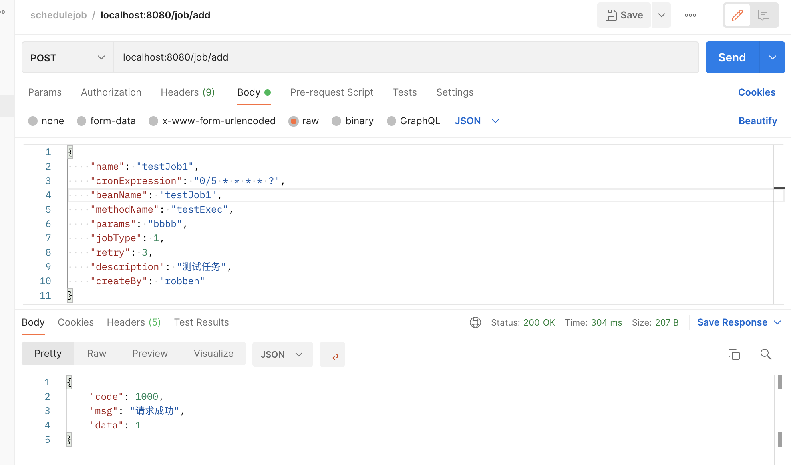
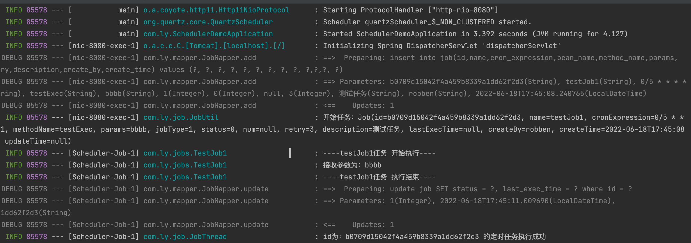
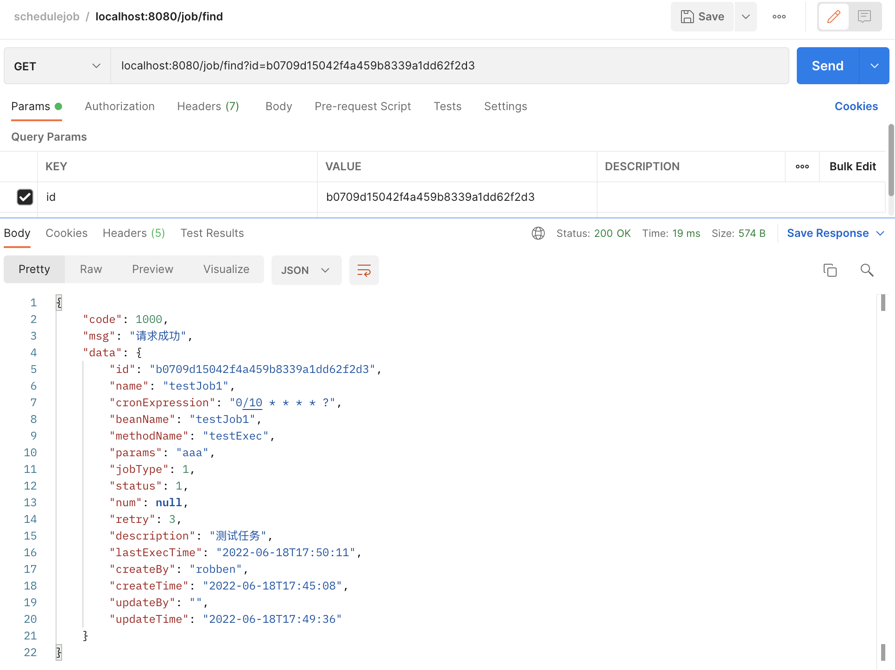
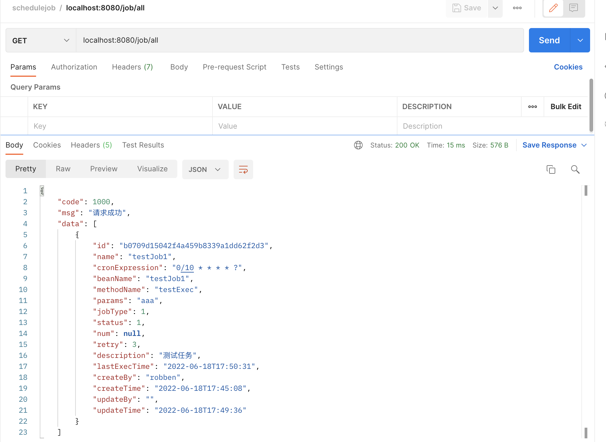
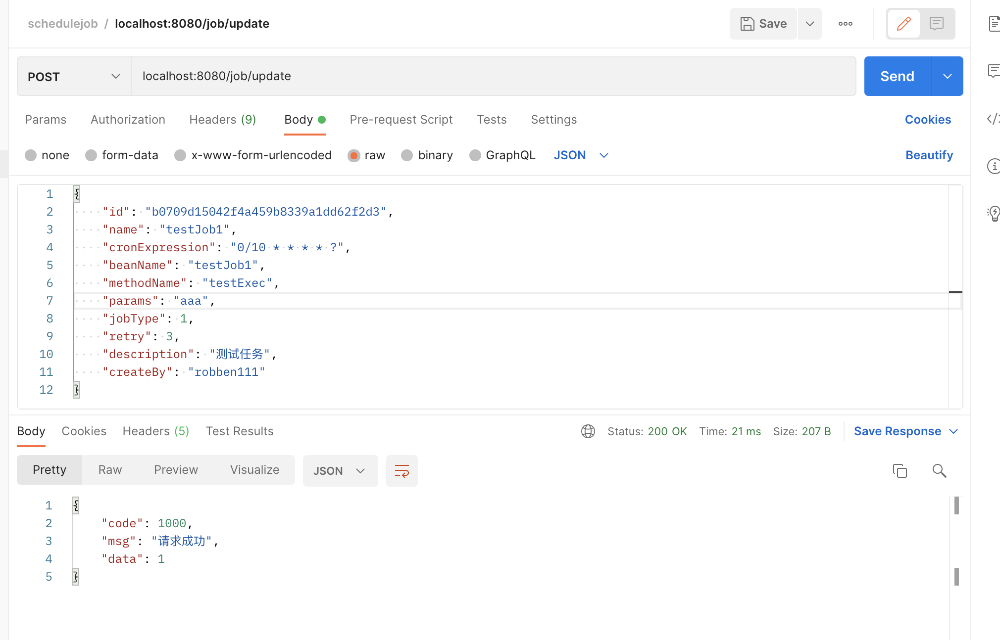
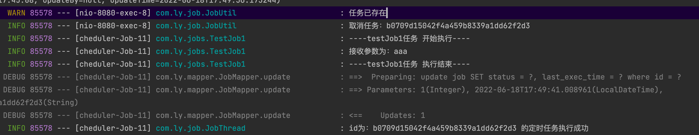
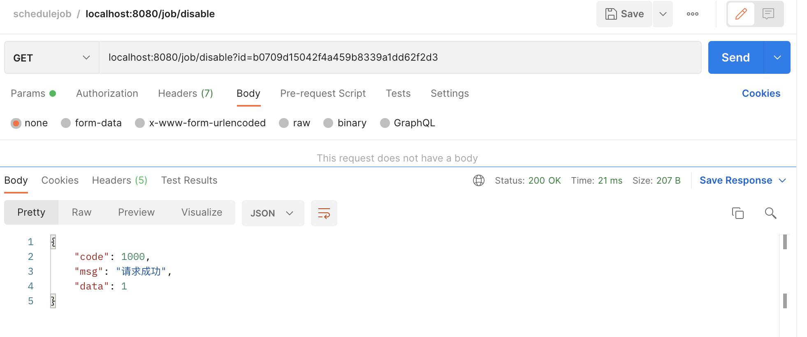
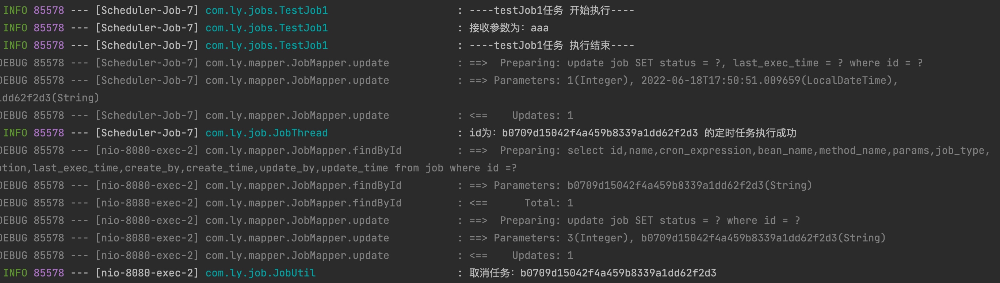

# 一个简单的动态定时任务Demo
## 项目主要技术栈：
* SpringBoot 2.7.0
* quartz
* mybatis
* durid
* hibernate-validator
* lombok
* mysql
---
## 本地环境准备：
* IDEA
* Docker Desktop
* JDK 11
* maven
* DBeaver(mysql免费客户端)
---
## mysql启动及初始化表结构
### 1. 到项目docker目录下使用docker compose文件启动mysql container
```
docker-compose -f mysql.yml up -d
```
*注：mysql账户密码在mysql.yml文件中可找到

### 2. 使用DBeaver连接好启动的mysql，导入项目db目录下 init.sql 文件初始化表结构

---
## TEST
### 1. add(POST)


### 2. find\all(GET)


### 3. update(POST)


### 4. disable(GET)


---

*注：可参考com.ly.jobs.TestJob1 或者 com.ly.jobs.TestJob1 类进行扩展新的任务，再通过add操作将任务加入线程池运行


